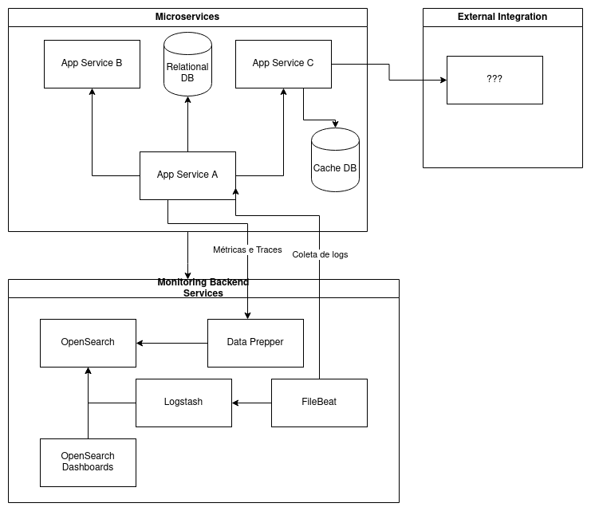

# pocs de observasbilidade #

Um projeto para estudar trace distribuído e monitoramento.

Tenho estudado sobre observabilidade e instrumentação de
código em Go. Eu venho do Java, onde era apenas adicionar 
o Java Agent do OpenTelemetry e ele fazia boa parte do trabalho
por você.

A inteção é criar um exemplo para cada aspecto de observabilidade,
da instrumentação do código a criação de painéis de monitoramento
e alertas com algumas ferramentas diferentes (não pretendo me
aprofundar muito nas ferramentas, apenas o necessário para os
exemplos) que facilitem o entendimento.


## idéia inicial ##

A idéia é criar um ambiente simulando alguns cenários comuns
de  sistemas e gerar visualização das métricas e dos traces
de trace e monitoramento.

Até o momento eu vi duas possibilidades, uma utilziando `Jaeger`,
que permite visualizar apenas os traces, e a outra utilziando a
stack do OpenSearch (OpenSearch, OpenSearch Dashboards, Data Prepper, Filebeat e Logstash), que permite pegar também as
métricas de runtime e logs, que permitem algumas opções extras.


### opção utilizando Jaeger ###

Uma das opções é utilizar o Jaegerpara visualização de
trace distribuído.


### opção utilizando Opensearch ###

Outra opção, que permite coletar também métricas de runtime,
como memória alocada, pausas do garbage collector (GC),
conexões de banco em uso e disponíveis, etc.




## links de referência ##


### bibliotecas Go OpenTelemetry e exemplos ###

- [riandyrn/otelchi - Github](https://github.com/riandyrn/otelchi/tree/master/examples/basic)
- [lightstep/opentelemetry-examples - Github](https://github.com/lightstep/opentelemetry-examples/blob/main/docker-compose.yml)
- [mdevilliers/open-telemetery-golang-bestiary - Github](https://github.com/mdevilliers/open-telemetery-golang-bestiary/blob/main/apps/x/otlp.go)
- [deviantony/docker-elk - Github](https://github.com/deviantony/docker-elk)


### docs observabilidade com Opensearch ###

- [Get started with Trace Analytics - Opensearch](https://opensearch.org/docs/1.2/observability-plugin/trace/get-started/)
- [Trace analytics](https://opensearch.org/docs/latest/observing-your-data/trace/index/)
- [Data Prepper configuration reference - bookstack.cn](https://www.bookstack.cn/read/opensearch-1.3.x-en/b4e83788f603aa05.md)
- [opensearchproject/logstash-oss-with-opensearch-output-plugin - DockerHub](https://hub.docker.com/r/opensearchproject/logstash-oss-with-opensearch-output-plugin)
- [Defining processors - Filebeat](https://www.elastic.co/guide/en/beats/filebeat/current/defining-processors.html)
- [Exported fields - Filebeat Processors](https://www.elastic.co/guide/en/beats/filebeat/current/exported-fields.html)
- [Migrating from Logstash](https://opensearch.org/docs/latest/data-prepper/migrating-from-logstash-data-prepper/)

### providers Terraform para Elasticsearch/Opensearch ###

- [elastic/terraform-provider-elasticstack - Github](https://github.com/elastic/terraform-provider-elasticstack)
- [phillbaker/terraform-provider-elasticsearch - Github](https://github.com/phillbaker/terraform-provider-elasticsearch)
- [opensearch-project/terraform-provider-opensearch - Github](https://github.com/opensearch-project/terraform-provider-opensearch)

- [elastic/terraform-provider-elasticstack - Terraform Registry](https://registry.terraform.io/providers/elastic/elasticstack/latest)
- [phillbaker/terraform-provider-elasticsearch - Terraform Registry](https://registry.terraform.io/providers/phillbaker/elasticsearch/latest)
- [opensearch-project/opensearch - Terraform Registry](https://registry.terraform.io/providers/opensearch-project/opensearch/latest)


## urls úteis ##

- http://localhost:5601/app/observability-dashboards#/trace_analytics/home


## snippets ##

```bash
## building data-prepper Docker image on Raspberry Pi
sudo apt-get install -y docker-ce docker-ce-cli containerd.io docker-buildx-plugin docker-compose-plugin
sudo apt-get install -y openjdk-17-jdk

git clone https://github.com/opensearch-project/data-prepper.git && \
    cd data-prepper && \
    sed -i 's|eclipse-temurin:17-jdk-alpine|arm64v8/eclipse-temurin|g' release/docker/Dockerfile && \
    sed -i 's|apk update|apt update|g' release/docker/Dockerfile && \
    sed -i 's|apk add --no-cache bash bc|apt install bc bash -y|g' release/docker/Dockerfile && \
    ./gradlew :release:docker:docker || echo "ERROR"
docker tag opensearch-data-prepper:2.2.0-SNAPSHOT eldius/opensearch-data-prepper:2.2.0-SNAPSHOT
docker push eldius/opensearch-data-prepper:2.2.0-SNAPSHOT
```
